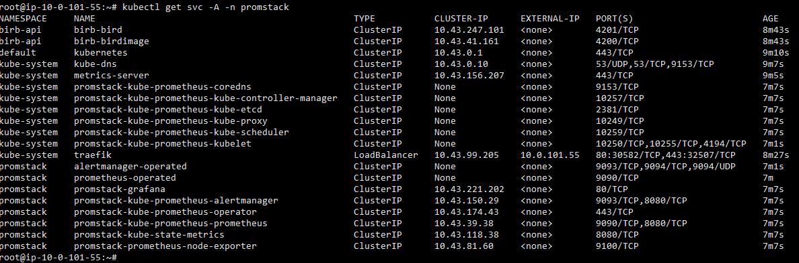

# My notes for the assignment

- [My notes for the assignment](#my-notes-for-the-assignment)
  - [Initial install](#initial-install)
    - [bird](#bird)
    - [birdImage](#birdimage)
  - [Dockerisation](#dockerisation)
    - [bird](#bird-1)
    - [birdImage](#birdimage-1)
  - [Create an infra on AWS (VPC, SG, instances) using IaC](#create-an-infra-on-aws-vpc-sg-instances-using-iac)
    - [Prerequisite](#prerequisite)
    - [Disclaimer](#disclaimer)
    - [Working with IaC](#working-with-iac)
  - [Install a small version of kubernetes on the instances (no EKS)](#install-a-small-version-of-kubernetes-on-the-instances-no-eks)
  - [Build the manifests to run the 2 APIs on k8s](#build-the-manifests-to-run-the-2-apis-on-k8s)
    - [Terraform and kubeconfig "magic"](#terraform-and-kubeconfig-magic)
  - [Bonus points: observability, helm, scaling](#bonus-points-observability-helm-scaling)
    - [Helm](#helm)
      - [Deploying](#deploying)
      - [App validation after helm deployment](#app-validation-after-helm-deployment)
    - [helm validation](#helm-validation)
    - [Scaling](#scaling)
    - [Observability](#observability)
  - [Others](#others)

## Initial install

### bird

1. In order to build locally the application I've had to install the correct version of golang. The one in the stable repo of Debian (1.19~1) was not enough. However I've had a backport repo installed, which had `1.22~3~bpo12+1`. `Make` is also a requirement in order to build this app.

    1. In order to establish which version is required I've done a simple check - just tried to run `make` inside the bird folder.

    2. In order to establish the available versions of packages in my system (Debian) I've ran two commands:

    ```bash
      apt list --all-versions golang
      apt-cache policy golang
    ```

    for other systems this might look differently.
    In order to download the package from a different repository (it defaulted to a different repository - the one with the lower weight/prio ) I've had to `apt` with a flag - pointing to that repo:

    ```bash
    apt instal -t stable-backports golang
    ```

    the `-t stable-backports` pointed at the repository.

2. I ran the application by starting it with `./getBird`, haven't seen any logs
3. In order to check what is roughly happening I've checked it with
    1. `ps auxf | grep -i bird` which showed me that it is working in the background, gave me the pid of the process
    2. `netstat -tpln` which told me which port it's working on (4201)
    3. checked the [code](https://github.com/lifinance/devops-challenge/blob/main/bird/main.go#L70), which also gave me the port - 4201

      ```go
      http.ListenAndServe(":4201", nil)
      ```

    4. I have made some changes to the code to allow passing the host and port for the birdImage. The ENV's are `BIRDIMAGE_HOST` and `BIRDIMAGE_PORT`

### birdImage

The build and start process is the same as the one for the `bird-app`. The difference is the port (4200) which the app is working on.

## Dockerisation

### bird

 In order to build the docker container I've ran:

 ```bash
 docker build --file Dockerfile-bird -t docker-bird .
 ```

After building the container, in order to run in I've ran:

```bash
docker run --network=host --name bird docker-bird
```

This, optionally could be ran with the `-d` flag so it's running in the background

### birdImage

 In order to build the docker container I've ran:

  ```bash
  docker build --file Dockerfile-birdImage -t docker-bird-image .
  ```

  ```bash
  docker run -d --network=host --name birdImage docker-bird-image
  ```

  I'm using the `-d` flag so it's running in the background

After running both containers I am able to `curl` to `localhost:4201` with a response:

  ```bash
  curl localhost:4201
  {"Name":"Albatross","Description":"Albatrosses are large seabirds known for their long wingspans and impressive gliding abilities.","Image":"\"https://images.unsplash.com/photo-1520582749333-c85ccec813a3?crop=entropy\\u0026cs=tinysrgb\\u0026fit=max\\u0026fm=jpg\\u0026ixid=M3w2Mzg4NzZ8MHwxfHNlYXJjaHwxfHxBbGJhdHJvc3N8ZW58MHx8fHwxNzI1ODI0NTM3fDA\\u0026ixlib=rb-4.0.3\\u0026q=80\\u0026w=200\"\n"}
  ```

## Create an infra on AWS (VPC, SG, instances) using IaC

### Prerequisite

We need to generate an [ssh-keypair](https://linuxconfig.org/how-to-generate-and-manage-ssh-keys-on-linux) and:

1. Replace the path to the private key in [`scp -i ~/.ssh/lifi-test`](./terraform/kubeconfig.tf#L13)
2. Replace the `public-key` field in [resource "aws_key_pair" "lifi-test"](./terraform/ec2.tf#L3)

### Disclaimer

I've created a few simple resources in order to finalise the assesment. These files can be found in the [terraform](./terraform) folder.

I've been using [pre-created terraform modules](https://registry.terraform.io/modules/terraform-aws-modules/vpc/aws/latest). This can be refactored in order to create our own modules and making the code more flexible (for reusability) - this would require us to predefine variables, environments with tfvars. Ideally I'd loop over complex variables (like a `type = object({ some_parameter = string, other_parameter = string })` ), that would allow us to easily create new instances of the called modules (creating multiple objects) and reuse the code (DRY). Optionally - from what I have heard/read Terragrunt can do a few things to make code DRY, but personally I have not used it.

For the sake of this excercise I've wanted to keep this simple and without the need of reinventing the wheel if we don't need to.

### Working with IaC

0. Install the required software - terraform and awscli
1. Configure your access to the cloud provider.
  For AWS this requires obtaining CLI credentials to an account with the correct permissions.
2. For this excercise you'd need an ssh-key pair. Please insert your PUBLIC key into the `public_key` field in the `resource "aws_key_pair" "lifi-test"`
3. Run `terraform init` from within the terraform folder
4. Run `terraform plan` from within the terraform folder *(sidenote: it's way nicer to read once we use `--no-color` and pipe it into an IDE `| code .`)*
5. Run `terraform apply` from within the terraform folder

## Install a small version of kubernetes on the instances (no EKS)

There are several ways to do this. The ones that came to my mind were:

1. Calling an ansible playbook while running terraform with the `provisioner` block.
2. Building a packer image from an existing AMI and installing an kubernetes cluster to it.
3. Using cloud-init to do the same as above as it's a native mechanism, we don't need any additional software and it should still do the job. [example](https://developer.hashicorp.com/terraform/tutorials/provision/cloud-init)

Personally I wouldn't use cloud-init for anything more complex due to it's readability. I'd go with building a packer image as it's easier to automate in the long run. Building custom images, base images, rolling out updates. However - in this case - cloud-init does it job. It's about picking the right tool for the right job. After all we don't need a massive tractor to do our small garden.

Note: in order to log into the ec2, with the Debian AMI we need to use the user `admin`

## Build the manifests to run the 2 APIs on k8s

  The manifests are located in the [k8s-manifests](./k8s-manifests) directory.
  There are several ways to deploy these manifests to the cluster:

  1. Use `kubectl apply -f filename.yaml` as long as you have connectivity to the cluster
  2. Applying manifests via Terraform.
  3. Creating manifests via Terraform (instead of yaml files; so pseudo-templating is possible)
  4. Using a deployment tool like ArgoCD (my prefered tool)

  However, I'd personally avoid manifests if possible and choose to use [Helm charts](./helm/bird).

  *Yes, I am aware of `helm template` and I am aware that many tools actually will template/bake the Helm chart into a manifest before applying.*

### Terraform and kubeconfig "magic"

  [*It's not magic, it's talent and sweat.*](https://www.youtube.com/watch?v=T_D3d1RWBrI)

  Short explanation of the janky script in [terraform/kubeconfig.tf](./terraform/kubeconfig.tf#L10-L18):

  Basically I'm trying to prevent terraform from crashing, because the cloudinit was not done yet. The final step in cloudinit is [exporting a kubeconfig to /tmp](./terraform/ec2.tf#L50) and this + creation of the EC2 can take a while. Therefore I've hacked a small retry mechanism that waits 20 seconds after each failed attempt up to 15 retries. After 15 retries - it'll either end or do a sed (IP replace) on the kubeconfig. Exit code != 0 we had an oopsie. Otherwise we're all good.

## Bonus points: observability, helm, scaling

### Helm

  There is no single correct way to create a helm chart. It really depends on the business needs, use case, design and some internal agreements and preferenes.

  [Chart](./helm/bird/)

#### Deploying

  *Technically - the assignment did not specify that we have to deploy anything to our cluster.*

  0. It's done via terraform. Personally I don't like this approach, but it is possible. Look at [terraform/deploy.tf](./terraform/deploy.tf)
  1. `helm upgrade --install --kubeconfig terraform/kubeconfig birb helm/bird/` that can be ran from the main folder. Optionally we can add the `-f` flag for passing over different value file. If we won't pass explicitly values (or should I say - values overrides) it'll take the default values (the ones added with the helm chart). We can also add `--create-namespace` and `-n namespace-name` for deploying the application in the correct namespace. Values can be also set at this level with `--set`.
  2. ArgoCD - we can set up an ArgoCD application as code (this is just a tiny part of the entire process):

  ```bash
  apiVersion: argoproj.io/v1alpha1
  kind: Application
  metadata:
    name: bird
  spec:
    destination:
      name: ''
      namespace: 'bird'
      server: 'https://kubernetes.default.svc'
    sources:
    - repoURL: 'https://github.com/Kapel/devops-challenges.git'
      targetRevision: HEAD
      path: charts/bird
      helm:
        valueFiles:
        - $values/helm/bird/values.yaml
    - repoURL: 'git@github.com:Kapel/devops-challenge.git'
      targetRevision: master
      ref: values
    project: default
    syncPolicy:
      automated:
        prune: false
        selfHeal: true
      syncOptions:
        - CreateNamespace=true
  ```

#### App validation after helm deployment

  1. My personal favourite is just to use [k9s](https://k9scli.io)
  2. We can check if the svc is responding correctly by port-forwarding ourselves to `kubectl port-forward svc/birb-bird 4201:4201`. in my case the service name is birb-bird. After running the port-forward command we can run `curl http://localhost:4201` and we should see something like:

  ```bash
  curl http://localhost:4201
  {"Name":"Blue Jay","Description":"The blue jay is a strikingly beautiful bird with its blue and white plumage, known for its intelligence and raucous calls.","Image":"\"https://images.unsplash.com/photo-1649115727823-5215e906dd57?crop=entropy\\u0026cs=tinysrgb\\u0026fit=max\\u0026fm=jpg\\u0026ixid=M3w2Mzg4NzZ8MHwxfHNlYXJjaHwxfHxCbHVlJTIwSmF5fGVufDB8fHx8MTcyNTk5MjM5OHww\\u0026ixlib=rb-4.0.     3\\u0026q=80\\u0026w=200\"\n"}
  ```

  3. If we are using an ingress we can try and send a curl to that one.
  4. If we are using a service type LoadBalancer we can try curling to the LB IP (depends on the LB type)

### helm validation

  1. We can list which releases have been deployed with helm - `helm ls -A` `-A` is for all namespaces. This way we can check the status of our helm deployment
  2. We can list all resources created by our helm release (in my case `birb`) - `kubectl get all --all-namespaces -l='app.kubernetes.io/managed-by=Helm,app.kubernetes.io/instance=birb'`
  3. We can list the templated objects created by our helm release - `helm get all birb`

### Scaling

0. It is crucial (or at least makes our life way easier) to have Kubernetes probes set up correctly in order to enjoy the benefits of autoscaling.

1. Out of the box (in case of helm charts created by `helm create nameofthechart`) we get the horizontal pod autoscaler (HPA). This one can scale against pod metrics - CPU and Memory utilization. [K8s docs](https://kubernetes.io/docs/tasks/run-application/horizontal-pod-autoscale/#support-for-resource-metrics) An example can be found for both apps in my code: [bird](./helm/bird/templates/bird/hpa.yaml) and [birdImage](./helm/bird/templates/birdImage/hpa.yaml)
2. Apparently kubernetes allows scaling against [custom metrics as well](https://kubernetes.io/docs/tasks/run-application/horizontal-pod-autoscale/#scaling-on-custom-metrics).
3. I've had a chance to use [Keda autoscaler](https://keda.sh) which can scale based on many other metrics and [scalers](https://keda.sh/docs/2.15/scalers/)

### Observability

Due to time constraints I have just [installed promstack](./terraform/deploy.tf#L26-L40), but it's missing a few steps to become a satisfying solution, which is described below:

1. From *ops perspective - we'd need to install / integrate the observability suite. LGTM (Loki for logs; Grafana for visualisation, Tempo for traces and Mimir for metrics). After getting these we can set up our dashboards. At the end we can start the process of monitoring, but *that's a whole different story!*
2. From the helm/manifest perspective - we need to create a service/pod monitor in order to scrape custom metrics from the application and have probes configured properly. Optionally we could use exporters to gather general metrics (CPU/RAM/restarts) about the application and k8s node health.
3. From a dev perspective - we might need to create some endpoints for custom metrics and tracing mechanism. [instrumentation](https://opentelemetry.io/docs/concepts/instrumentation/)



## Others

I really apprecieate the Missigno Pokémon as an error.
